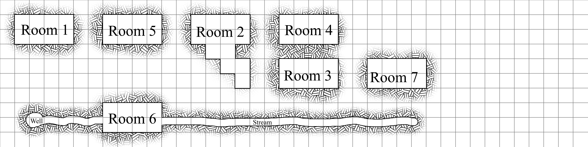

# Level 1

In general I am designing this dungeon without a map in mind, but I find it helpful to have a map at times. I think of the below maps as more of a possible layout than a fixed layout.

## Week 1

The first level, exists on a roughly two different planes, with [Room 6](Room_6.md), and the stream that connects [Room 6](Room_6.md) and [Room 7](Room_7.md) on one level, and the rest of the rooms on another. 

[Room](Room_1.md) and [Room 5](Room_5.md) both connect to the water level.

[Room 2](Room_2.md) slops downward, so [Room 7](Room_7.md) and the floor of [Room 3](Room_3.md) are both bellow the other rooms, but above [Room 6](Room_6.md) and it's stream.

Both [Room 1](Room_1.md) and [Room 2](Room_2.md) can be accessed from above. 

### Week 1, all rooms

### Diagram showing the vertical relationship between rooms.

### Just the 'Catacomb' layer

### Just the 'Water' layer
