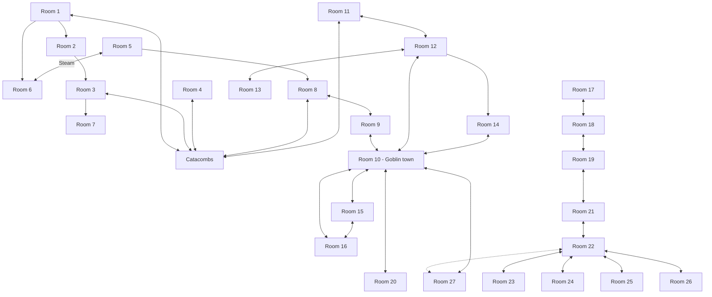
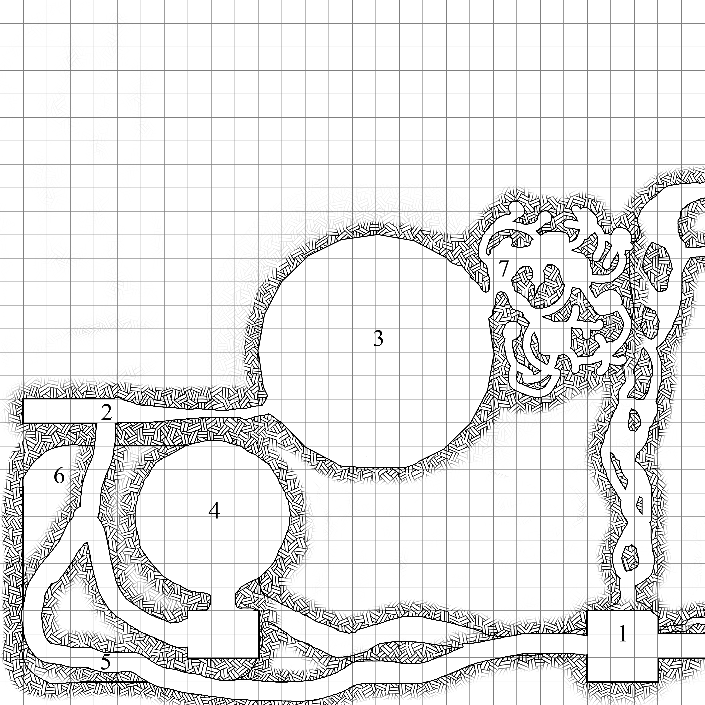
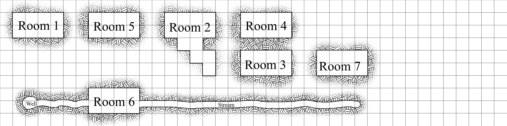
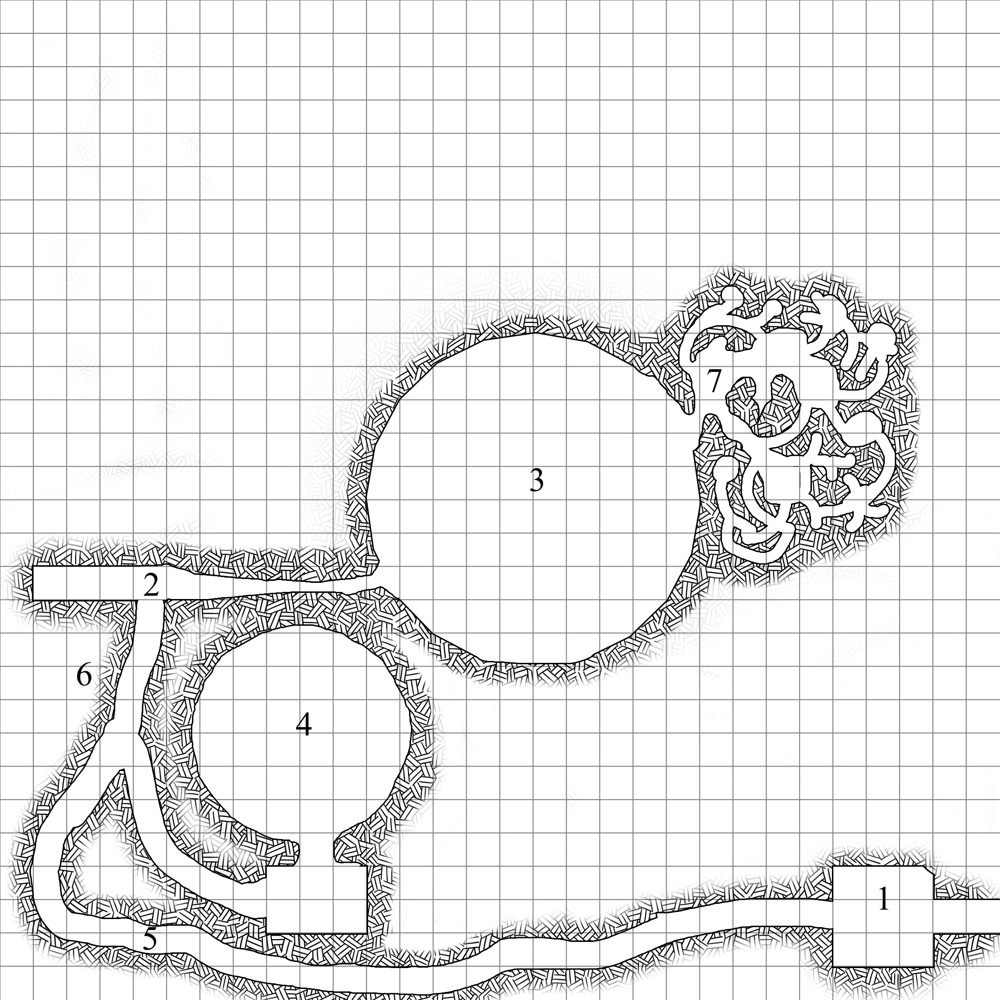
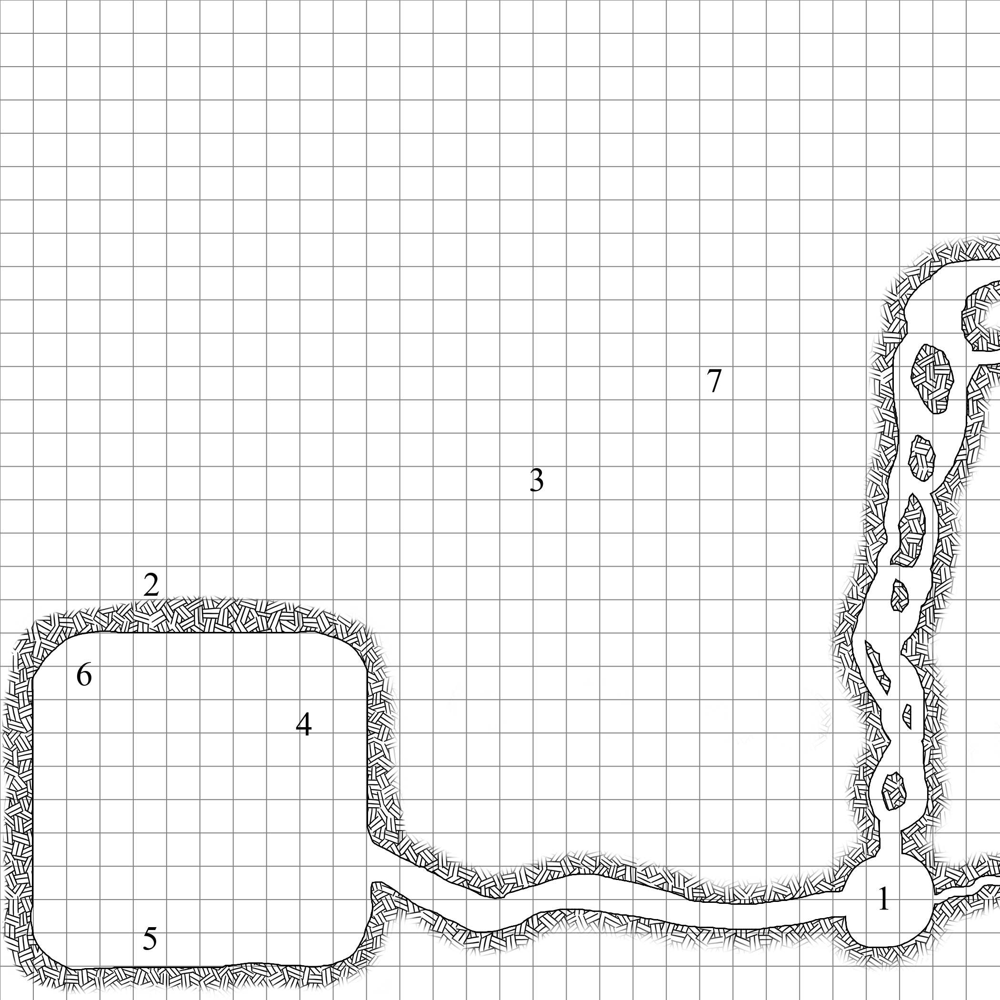

# Level 1

<!-- 

## Week 1

The first level, exists on a roughly two different planes, with [Room 6](Room_06.md), and the stream that connects [Room 6](Room_06.md) and [Room 7](Room_07.md) on one level, and the rest of the rooms on another. 

[Room 1](Room_01.md) and [Room 5](Room_05.md) both connect to the water level.

[Room 2](Room_02.md) slops downward, so [Room 7](Room_07.md) and the floor of [Room 3](Room_03.md) are both bellow the other rooms, but above [Room 6](Room_06.md) and it's stream.

Both [Room 1](Room_01.md) and [Room 2](Room_02.md) can be accessed from above. 

### Week 1, all rooms

### Diagram showing the vertical relationship between rooms.

### Just the 'Catacomb' layer

### Just the 'Water' layer

-->