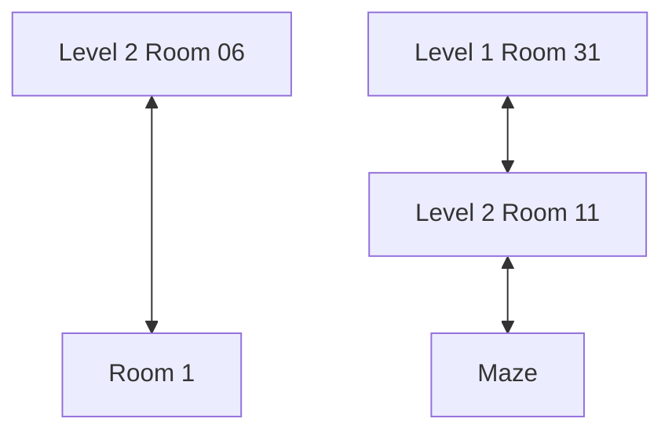
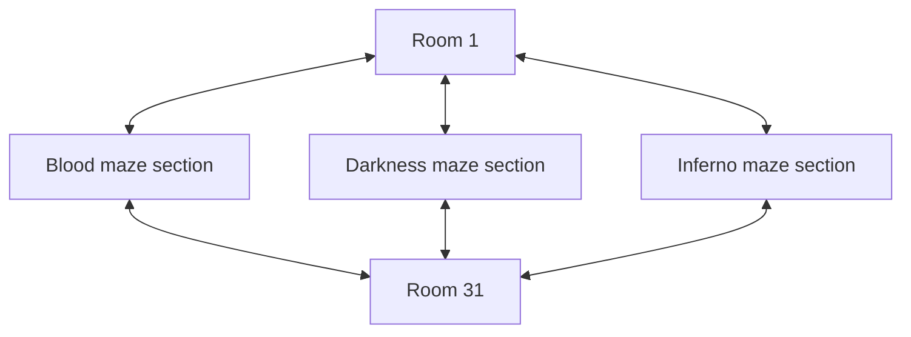
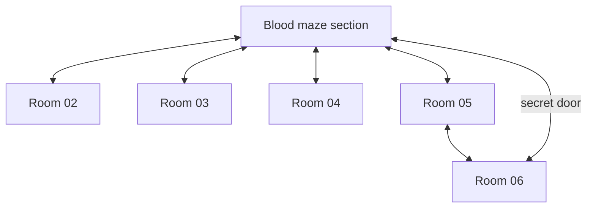

# Level 3

Level 3 is dominated by a vast maze, and thus there is little to make a flowchart as most rooms in the maze can easily lead to most other rooms.

## Connections to other levels:

## Maze "layout"

## Blood section
