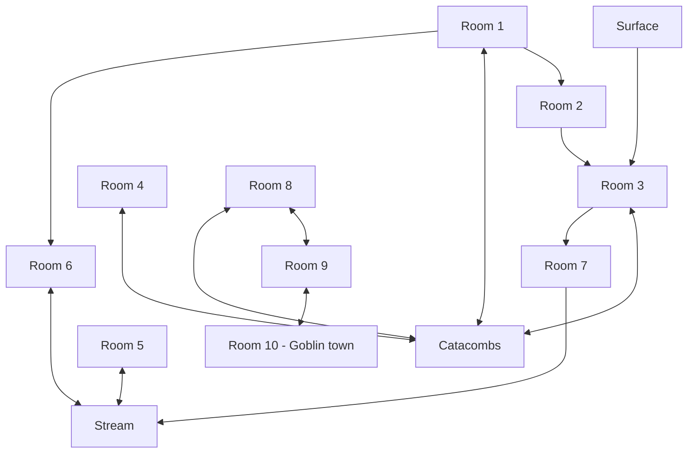

# Crypts

[[ Room_01, Room_02, Room_03, Room_04, Room_05, Room_06, Room_07, Room_08, Room_09, Room_10]]

| 2d6 | Result                             |
|-----|------------------------------------|
| 2   | pack of feral Ghouls               |
| 3   | Delver                             |
| 4   | Stagnate water                     |
| 5   | Animated corpse                    |
| 6   | Ghoul                              |
| 7   | Pile of bones, freshly gnawed upon |
| 8   | Feral Ghoul                        |
| 9   | Necromantic cultist acolyte        |
| 10  | Supplies                           |
| 11  | Necromancer                        |
| 12  | Roll twice, ignore 12s             |

---